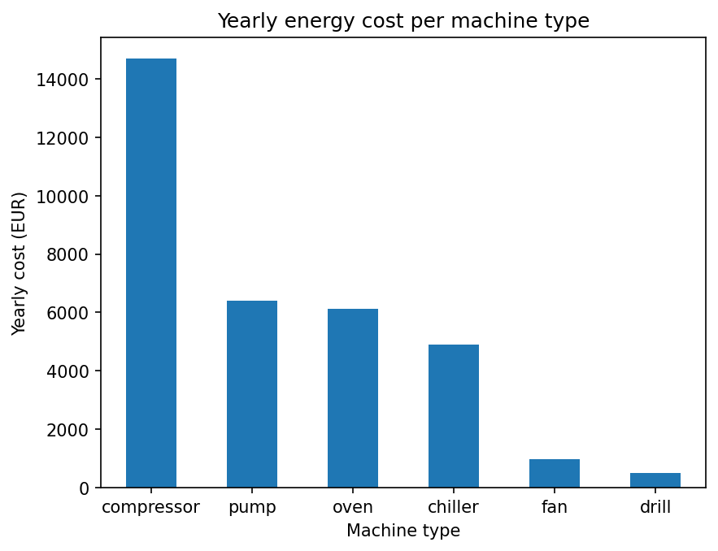
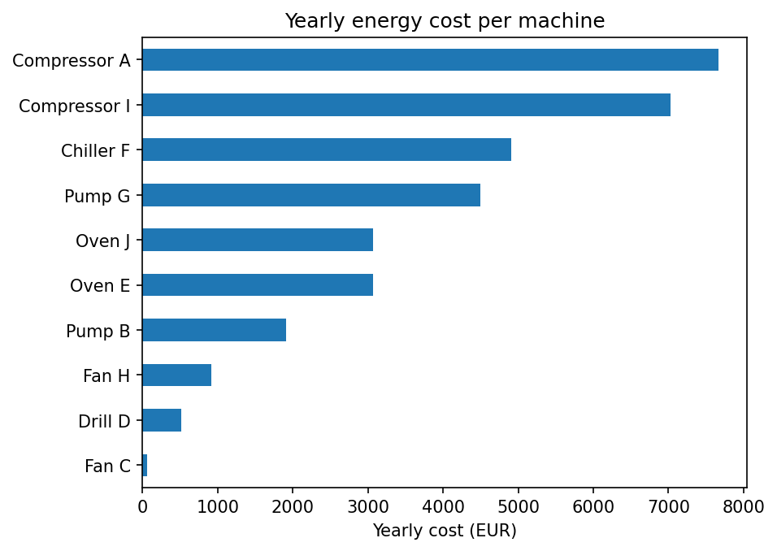
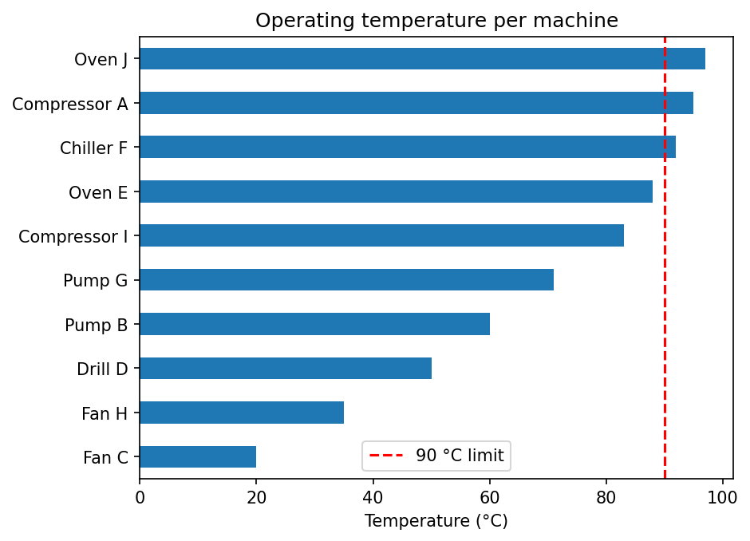
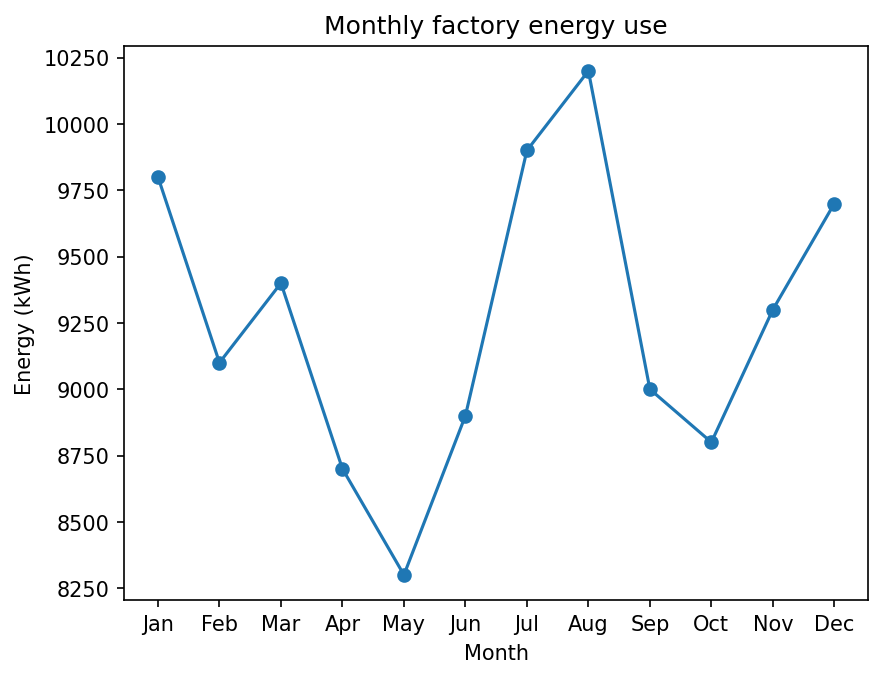

# Factory Energy Analysis

Analysis of energy use, operating cost and temperature for 10 industrial machines,
built with Python (pandas, matplotlib).

## Key findings
- Compressors account for **44% of total energy cost** (14,691 of 33,636 EUR/year)
- **3 machines run above the 90 °C limit**: Oven J, Compressor A, Chiller F
- Energy use follows a **seasonal U-shape**: peak in August (cooling) and winter (heating)

## Recommendations
1. Prioritise maintenance for the 3 overheating machines
2. Focus energy-saving efforts on compressors
3. Schedule maintenance shutdowns in low-demand months (May/October)

## Charts

### Yearly cost per machine type

### Yearly cost per machine

### Operating temperature per machine

### Monthly energy use

## Files
| File | Content |
|---|---|
| `Factory_Energy_Report.ipynb` | Full analysis notebook with charts and insights |
| `factory.csv` | Machine data (power, running hours, temperature) |
| `*.png` | Exported charts |

## Assumptions
Electricity price 0.35 EUR/kWh, 365 operating days per year. Data is illustrative.

## Tools
Python · pandas · matplotlib · Google Colab

## About
Mechanical engineer (B.E.) and M.Sc. AI/Data Science student in Berlin, combining
industrial engineering experience (thermal systems, compressors) with data analysis.
